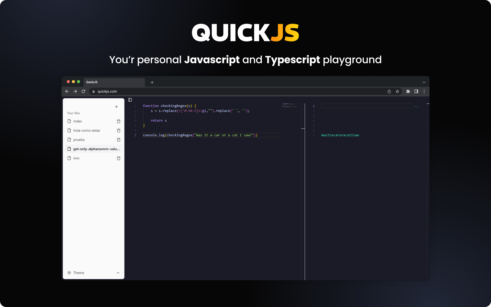

# QUICKJS



You'r personal JavaScript and TypeScript playground. Write and run your code in a safe and secure environment.

## Features

- [x] Write and run JavaScript code
- [x] Write and run TypeScript code
- [x] Create and delete scripts
- [ ] Save and load scripts
- [ ] Share scripts
- [ ] Change theme
- [ ] Add environment variables
- [ ] Self-hosted with Docker

### How to run

QuickJS is a simple web application built with React and using Vite as a bundler. To run the application, follow the steps below:

1. Clone the repository

```bash
git clone
```

2. Install dependencies

```bash
npm install
```

3. Run the application

```bash
npm run dev
```

4. Open the browser and navigate to `http://localhost:3000`
